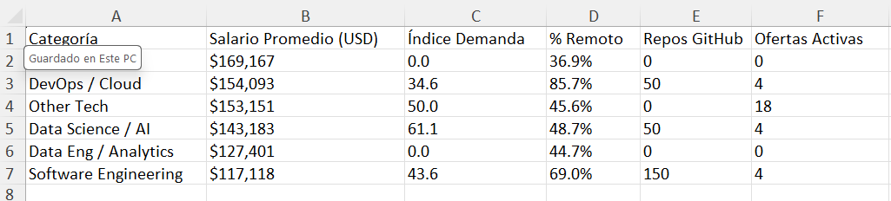
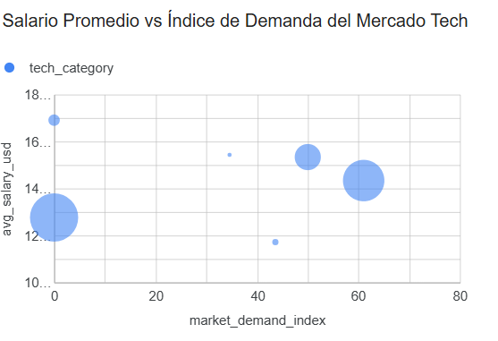
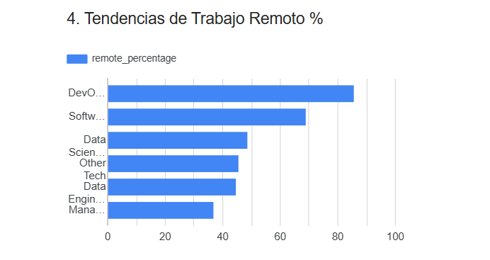
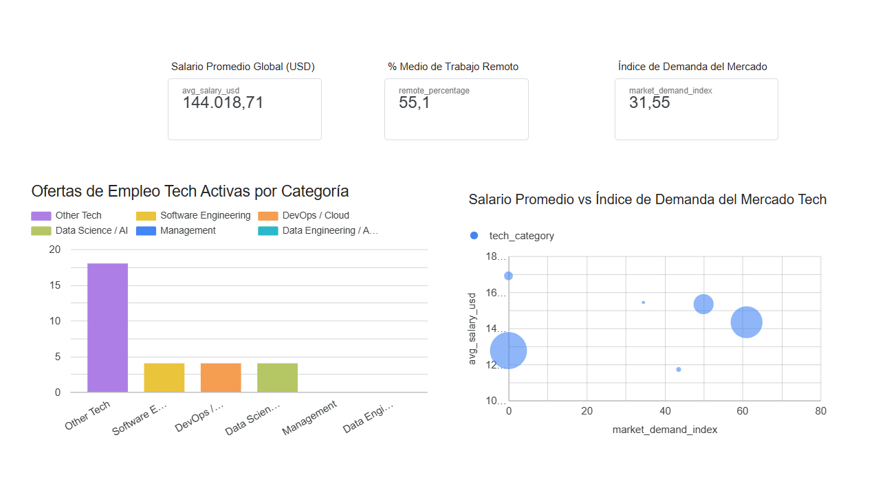

# 📊 Dashboard BI: Análisis del Mercado Laboral Tech 2024

[](https://www.python.org/)
[](https://pandas.pydata.org/)
[](https://numpy.org/)
[](https://matplotlib.org/)
[](https://seaborn.pydata.org/)
[](https://lookerstudio.google.com/)
[](https://www.google.com/sheets/about/)
[](LICENSE)
[]()

> **Reto 1 — Business Intelligence y Big Data | Odisea Data**
> Pipeline ETL completo en Python + Dashboard interactivo en Looker Studio

---

## 🎯 Objetivo del proyecto

Crear un **tablero de Business Intelligence** que integre múltiples fuentes de datos heterogéneas (CSV histórico y APIs web en tiempo real) para analizar:

- 💰 **Salarios** en el sector tech
- 📈 **Demanda tecnológica** por categoría
- 🏠 **Tendencias de trabajo remoto** en 2024

---

## 🛠️ Stack tecnológico

<p align="center">
  
  
  
  
  
</p>

| Área | Tecnologías |
|---|---|
| **Lenguaje** | Python 3.10+ |
| **ETL & Datos** | pandas, NumPy, Requests, Loguru |
| **Visualización EDA** | Matplotlib, Seaborn |
| **BI Tool** | Looker Studio (Google) |
| **Conector de datos** | Google Sheets (actualización automática) |

---

## 📁 Estructura del proyecto

```
reto1-bi-odisea-data/
│
├── data/
│   ├── raw/                          # Datos crudos (CSV + JSONs de APIs)
│   │   ├── ds_salaries_2023.csv
│   │   ├── github_top_repos.json
│   │   └── remoteok_jobs.json
│   ├── processed/
│   │   └── master_dataset.csv        # Dataset maestro unificado
│   └── external/
│       └── ds_salaries_info.txt      # Metadatos y diccionario
│
├── scripts/
│   ├── extract/                      # Extractores
│   │   ├── extractor_bls.py
│   │   ├── extractor_github.py
│   │   ├── extractor_remoteok.py
│   │   └── extractor_salaries.py
│   ├── transform/                    # Limpieza e integración
│   │   └── integracion.py
│   └── utils/                        # Config, logging, cliente HTTP
│       ├── api_client.py
│       ├── config.py
│       └── logger.py
│
├── outputs/
│   ├── charts/                       # Gráficos EDA (PNG)
│   │   ├── ofertas_empleo_por_tecnologia.png
│   │   └── salario_vs_demanda.png
│   ├── csv_analysis/
│   │   └── kpi_resumen_tecnologico.csv
│   ├── screenshots/                  # Capturas del dashboard
│   └── QR.png                        # QR al dashboard
│
├── docs/                             # Entregables del reto
│   ├── Informe_Proceso_BI.md
│   ├── Informe_Proceso_BI.pdf
│   ├── Analisis_visualizaciones.md
│   ├── Analisis_visualizaciones.pdf
│   ├── Análisis del Mercado Laboral Tech 2024.pptx
│   └── presentacion/
│
├── dashboards/
│   ├── Informe_looker_studio.pdf
│   └── looker_studio_link.txt        # URL pública del dashboard
│
├── logs/
│   └── etl_pipeline.log
│
├── requirements.txt
├── .env.example
├── .gitignore
├── LICENSE
└── README.md
```

---

## 🚀 Cómo ejecutar el pipeline ETL

### 1. Requisitos previos

- **Python 3.10+**
- **Token de GitHub** (Personal Access Token) configurado en `.env`
- **Conexión a internet** activa (para llamadas a APIs)

### 2. Instalación

```bash
git clone https://github.com/jdthgp27/reto1-bi-odisea-data.git
cd reto1-bi-odisea-data

python -m venv venv
source venv/Scripts/activate  # Windows (Git Bash)

pip install -r requirements.txt
```

### 3. Configuración de credenciales

Crea un archivo `.env` en la raíz del proyecto (puedes copiar de `.env.example`):

```bash
cp .env.example .env
```

Edita `.env` con tu token de GitHub:

```
GITHUB_TOKEN=ghp_tu_token_aqui
```

> ⚠️ **Nunca subas el archivo `.env` a GitHub** — está excluido en `.gitignore`

### 4. Ejecución por fases

El pipeline se ejecuta fase por fase:

**Fase 1: Extracción de datos**

```bash
python scripts/extract/extractor_salaries.py
python scripts/extract/extractor_github.py
python scripts/extract/extractor_remoteok.py
```

**Fase 2: Transformación e integración**

```bash
python scripts/transform/integracion.py
```

> **Nota**: El script de integración genera automáticamente:
> - `data/processed/master_dataset.csv`
> - Los gráficos EDA en `outputs/charts/`
> - Los KPIs derivados en `outputs/csv_analysis/`

---

## 📊 Dataset maestro integrado

Se fusionaron **3 fuentes heterogéneas** en un único dataset con:

- **6 categorías tecnológicas**
- **14 métricas** por categoría



---

## 📸 Visualizaciones principales

### Salario vs Demanda del mercado

Gráfico de dispersión que muestra el equilibrio entre salario promedio e índice de demanda por categoría tecnológica.



### Tendencias de trabajo remoto

Gráfico de barras con la distribución de ofertas de empleo tech activas en tiempo real.



### Dashboard completo



---

## 🔗 Dashboard interactivo

Accede al tablero completo en **Looker Studio** con filtros dinámicos y actualización automática:

### 👉 [Ver Dashboard en Looker Studio](https://datastudio.google.com/s/vrjk2dhPISM)

El dashboard se actualiza automáticamente desde Google Sheets, que a su vez se alimenta del `master_dataset.csv` generado por el pipeline.

---

## 💡 Hallazgos destacados

1. **Data Science / AI** ofrece el mejor equilibrio entre alta demanda (61,1/100) y salarios competitivos (143.000 $).

2. **DevOps / Cloud** lidera indiscutiblemente el trabajo remoto con un **85,7%**, consolidándose como el rol más flexible.

3. **La popularidad en GitHub actúa como indicador adelantado** de demanda laboral, antes de reflejarse en portales de empleo tradicionales.

4. **Los roles de Management tienen los salarios más altos pero nula presencia en APIs públicas**, sugiriendo un mercado cerrado basado en networking directo.

---

## 📝 Entregables del reto

| # | Entregable | Ubicación |
|---|---|---|
| ✅ | **Dashboard de BI (Looker Studio)** | [Ver dashboard](https://datastudio.google.com/s/vrjk2dhPISM) |
| ✅ | **Informe del proceso de creación** | [docs/Informe_Proceso_BI.pdf](docs/Informe_Proceso_BI.pdf) |
| ✅ | **Análisis y visualizaciones clave** | [docs/Analisis_visualizaciones.pdf](docs/Analisis_visualizaciones.pdf) |
| ✅ | **Presentación para público no técnico** | [docs/Análisis del Mercado Laboral Tech 2024.pptx](docs/An%C3%A1lisis%20del%20Mercado%20Laboral%20Tech%202024.pptx) |
| ✅ | **Informe del dashboard (PDF)** | [dashboards/Informe_looker_studio.pdf](dashboards/Informe_looker_studio.pdf) |
| ✅ | **Código fuente documentado y reproducible** | Carpeta `scripts/` |

---

## 🎓 Conclusiones

Este proyecto demuestra cómo **integrar datos de múltiples fuentes heterogéneas** (CSV histórico + APIs en tiempo real) para generar un **cuadro de mando ejecutivo** que soporta decisiones estratégicas sobre:

- **Qué tecnologías priorizar** en la formación de equipos
- **Dónde están los mejores salarios** por nivel de demanda
- **Qué roles ofrecen mayor flexibilidad** (trabajo remoto)

El dashboard resultante es una **herramienta práctica para reclutadores, candidatos y responsables de RRHH** en el sector tech.

---

## 🔄 Próximas mejoras

- [ ] Añadir análisis geográfico (salarios por país/ciudad)
- [ ] Integrar más APIs (LinkedIn, Indeed, Glassdoor)
- [ ] Análisis de series temporales para detectar tendencias
- [ ] Modelo predictivo de salarios con ML
- [ ] Actualización automática con GitHub Actions

---

## 👤 Autora

**Judit Giravent Pineda**

- Business Analytics Student | Odisea Data
- GitHub: [@jdthgp27](https://github.com/jdthgp27)
- LinkedIn: [linkedin.com/in/judit-giravent-27b167156](https://linkedin.com/in/judit-giravent-27b167156)
- Email: jdthgp27@gmail.com

---

## 📜 Licencia

Este proyecto está bajo la **Licencia MIT**. Consulta el archivo [LICENSE](LICENSE) para más detalles.

---

*Proyecto desarrollado como parte del curso **Business Intelligence y Big Data** de Odisea Data. Septiembre 2026.*

---

⭐ Si este proyecto te ha resultado útil, considera darle una estrella en GitHub.